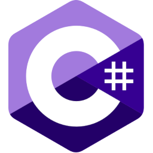
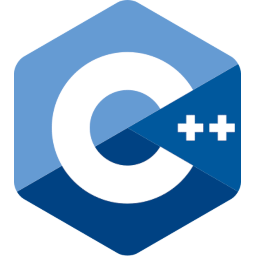
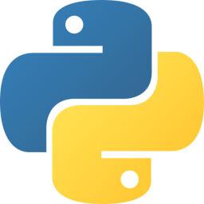
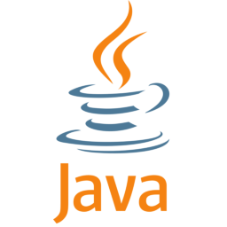
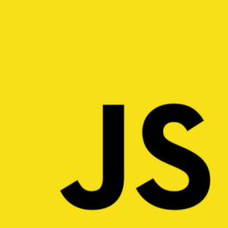

# Hello there, I'm Fabian!
I am 22 years old and I live in Germany.

I'm a self taught programmer and have been pursuing this wonderful hobby since
my early teen years. Later I got proper education.

I am now working as a Full Stack software developer.

## Programming languages I like
(And also some that I just used in the past or have to use currently with no alternative. I cannot prefix this list with "like" if it contains entries that contain "hate". That would be lying!)

<table>
	<thead>
		<tr>
            <th>Logo</th>
			<th>Language</th>
			<th>Small Note</th>
		</tr>
	</thead>
	<tbody>
		<tr>
            <td></td>
			<td align="center">C#</td>
			<td>The first I learned and my absolute favourite! Probably the most comfortable with out of all these languages.</td>
		</tr>
		<tr>
            <td></td>
			<td align="center">C</td>
			<td>Performance and manual memory management are buried deep in my heart! Can't get any closer to the CPU without it getting uncomfortable. :P</td>
		</tr>
		<tr>
            <td></td>
			<td align="center">C++</td>
			<td>I am by no means an expert when it comes to advanced C++ features. But my love for C gives it a free seat on my list.</td>
		</tr>
        <tr>
            <td></td>
			<td align="center">Python</td>
			<td>Just recently used it more. <s>I like it now &#x28;:</s> Since working with it in production critical applications and large projects: GOD NO PLEASE NO. Small scripts and projects are ok.</td>
		</tr>
        <tr>
            <td></td>
			<td align="center">Java</td>
			<td>Not using it anymore, but used to do a lot of modding with it for Minecraft. (The only valid use-case for Java is Minecraft)</td>
		</tr>
        <tr>
            <td></td>
			<td align="center">JavaScript</td>
			<td>I don't like it that much but i'm reasonably comfortable using it. (Emphasis on the "<b>I DON'T LIKE IT</b>"-part)</td>
		</tr>
        <tr>
		<tr>
            <td></td>
			<td align="center">TypeScript</td>
			<td>Well it is much more usable than JS... But still based on JS and compiled to JS. Which is- bad to say the least. (<em>I HATE JS</em>)</td>
		</tr>
        <tr>
            <td></td>
			<td align="center">PHP</td>
			<td>Used it exclusively as my choice for server-side scripting many years ago. Times have changed :sweat_smile: (Emphasis on "USED IT")</td>
		</tr>
		<tr>
            <td></td>
			<td align="center">Rust</td>
			<td>Every now and then I enjoy wandering around in rust. With the - up until its incarnation - completely foreign way of thinking about memory. But I am still a manual memory manager at heart; however a GC is cool too, given how much I love C#.</td>
		</tr>
	</tbody>
</table>

## Topics I like
- :man_technologist: General Purpose Software development (Preferably using C#)
- :brain: Machine Learning (But no LLMs please)
- :computer: Embedded Systems Programming
- :no_entry: IT security
- :lock: Cryptography

## Github :octocat:
Thank you for taking the time to read my readme. :blush:

I hope you're gonna have a very nice day!! :sparkles::sparkles:

Funny meme:

